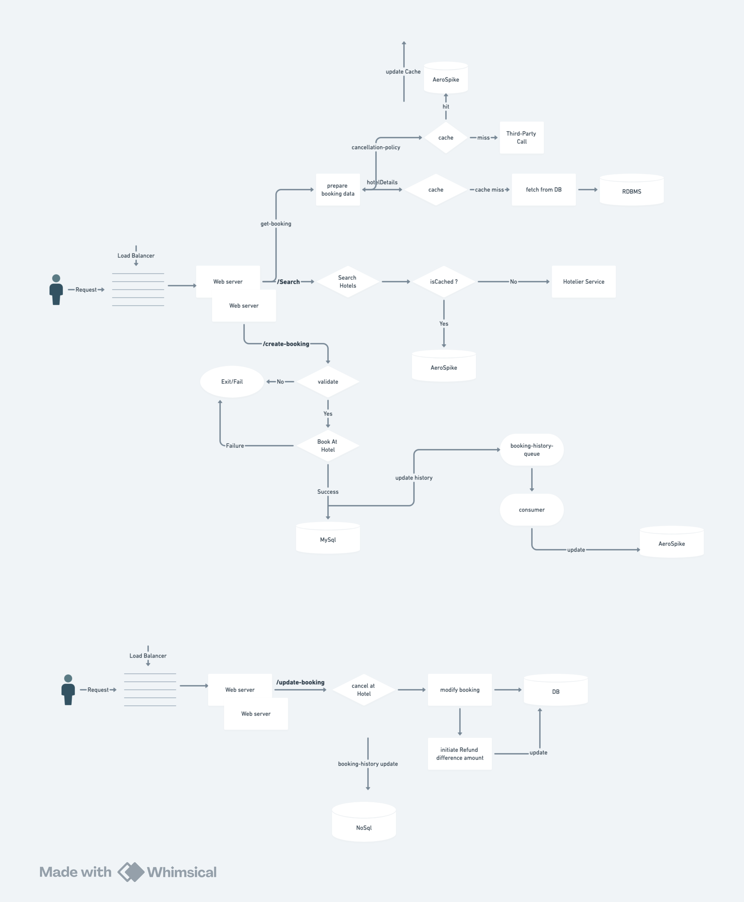

# hrs-hotel-booking
hotel booking platform for users

# Hotel Booking System

## System Architecture

### Architecture Diagram


## API Documentation

### Search Hotels API

#### Endpoint
```http
POST /api/search/hotels
```

#### Request Body
```json
{
    "city": "Mumbai",
    "checkInDate": "2024-04-01",
    "checkOutDate": "2024-04-05",
    "roomType": "Double",
    "numberOfRooms": 1,
    "numberOfGuests": 2,
    "minPrice": 5000,
    "maxPrice": 15000,
    "category": "5-star"
}
```

#### Curl Command
```bash
curl -X POST 'http://localhost:8080/api/search/hotels' \
-H 'Content-Type: application/json' \
-d '{
    "city": "Mumbai",
    "checkInDate": "2024-04-01",
    "checkOutDate": "2024-04-05"
}'
```

#### Response Example
```json
[
    {
        "hotelCode": "TAJ001",
        "name": "Taj Mahal Palace",
        "city": "Mumbai",
        "category": "5-star",
        "basePrice": 10000.0,
        "imageUrls": [
            "https://foto.hrsstatic.com/fotos/0/2/269/213/80/000000/http%3A%2F%2Ffoto-origin.hrsstatic.com%2Ffoto%2F9%2F5%2F8%2F4%2F%2Fteaser_958455.jpg"
        ],
        "description": "Luxury 5-star hotel in Mumbai",
        "amenities": [
            "Swimming Pool",
            "Spa",
            "Fine Dining",
            "Business Center"
        ],
        "rating": 4.8,
        "totalReviews": 1200,
        "location": "Colaba, Mumbai",
        "checkInTime": "14:00",
        "checkOutTime": "12:00",
        "available": true
    }
]
```

#### Response Fields
- `hotelCode`: Unique identifier for the hotel
- `name`: Hotel name
- `city`: City location
- `category`: Star rating
- `basePrice`: Starting price per night
- `imageUrls`: List of hotel images
- `description`: Hotel description
- `amenities`: List of available amenities
- `rating`: Average rating (0-5)
- `totalReviews`: Number of reviews
- `location`: Specific location in city
- `checkInTime`: Check-in time
- `checkOutTime`: Check-out time
- `available`: Room availability status

#### Error Responses
```json
{
    "error": "Bad Request",
    "message": "Invalid date format",
    "status": 400
}
```

## Database Setup

### MySQL Database Configuration
```properties
spring.datasource.url=jdbc:mysql://localhost:3306/hrsdb
spring.datasource.username=root
spring.datasource.password=
spring.jpa.hibernate.ddl-auto=update
spring.jpa.show-sql=true
```

### Table Creation Queries

#### Hotel Table (Master table)
```sql
CREATE TABLE hotel (
    code VARCHAR(50) PRIMARY KEY,
    name VARCHAR(100) NOT NULL,
    city VARCHAR(50) NOT NULL,
    status INT NOT NULL,
    contactno VARCHAR(20),
    category VARCHAR(50),
    vendorno VARCHAR(50),
    address TEXT,
    company_code VARCHAR(50)
);
```

#### Hotel Details Table
```sql
CREATE TABLE hotel_details (
    booking_id VARCHAR(50),
    lineno INT,
    country_of_travel VARCHAR(50),
    travel_city VARCHAR(50),
    check_in_date DATE,
    check_out_date DATE,
    hotel_code VARCHAR(50),
    hotel_name VARCHAR(100),
    booking_status INT,
    hotel_status INT,
    no_of_nights INT,
    room_type INT,
    vendor_no VARCHAR(50),
    no_of_rooms INT,
    base_amount DECIMAL(10,2),
    igst_amount DECIMAL(10,2),
    cgst_amount DECIMAL(10,2),
    sgst_amount DECIMAL(10,2),
    tax_amount DECIMAL(10,2),
    selling_price DECIMAL(10,2),
    discount_amount DECIMAL(10,2),
    currency_code VARCHAR(10),
    currency_factor DECIMAL(10,2),
    booking_created_date DATETIME,
    remarks TEXT,
    PRIMARY KEY (booking_id, lineno)    
);
```

#### Cancellation Details Table
```sql
CREATE TABLE cancellation_details (
    booking_id VARCHAR(50),
    cancellation_id VARCHAR(50),
    line_no INT,
    room_line_no INT,
    cancellation_date DATETIME,
    refund_amount DECIMAL(10,2),
    cancellation_reason TEXT,
    cancellation_status VARCHAR(20),
    cancellation_by VARCHAR(50),
    cancellation_remarks TEXT,
    refund_mode INT,
    PRIMARY KEY (booking_id, cancellation_id, line_no)    
);
```

#### User Table
```sql
CREATE TABLE user (
    user_id VARCHAR(50) PRIMARY KEY,
    user_name VARCHAR(100) NOT NULL,
    email VARCHAR(100) UNIQUE,
    phone VARCHAR(20)
);
```

## API Endpoints

### Booking Management
- `POST /api/bookings/createBooking` - Create a new booking
- `GET /api/bookings/getBooking/{bookingId}` - Get booking details
- `PUT /api/bookings/updateBooking` - Update booking details
- `DELETE /api/bookings/cancelBooking/{bookingId}` - Cancel a booking

## Setup Instructions

1. Create MySQL database:
```sql
CREATE DATABASE hotel_booking;
```
2. Run the table creation queries in the order provided above

3. Update application.properties with your database credentials

4. Run the application:
```bash
mvn spring-boot:run
```
## Highe-Level Design
### System Architecture


